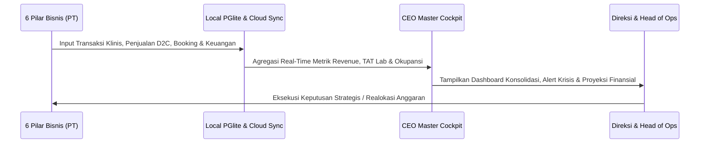
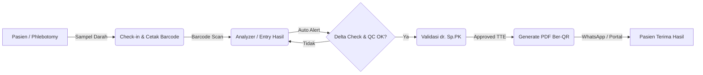
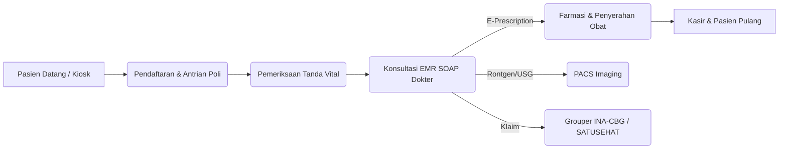

# DOKUMEN LAPORAN EKSEKUTIF ARSITEKTUR SISTEM & PEMETAAN MENU
## AVA GLOBAL HOLDING (ONE PLATFORM — 6 PILAR BISNIS & SUPPORT SYSTEM)

> **Catatan revisi 30 Agustus 2026.** Dokumen ini menjelaskan peta menu yang
> *dituju*. Untuk keadaan yang benar-benar terpasang — termasuk menu yang
> sempat tidak tersambung dan portal korporat yang dipulihkan — lihat
> [docs/audit/05-KOREKSI-DAN-PERBAIKAN.md](docs/audit/05-KOREKSI-DAN-PERBAIKAN.md).

**Dokumen No:** AVA-DOC-ARCH-2026-V5.1  
**Tanggal Rilis:** 30 Agustus 2026  
**Otoritas Penyusun:** Head of Operations (Ace Anwar) & Antigravity Core AI  
**Klasifikasi:** Dokumen Tata Kelola Sistem Informasi Terintegrasi  

---

## 1. STRUKTUR EKOSISTEM HOLDING & BADAN HUKUM (6 PT)

Ekosistem sistem **AVA GLOBAL** mengintegrasikan 1 Holding Utama, 6 Entitas Bisnis Anak Perusahaan (PT), serta 7 Modul Tata Kelola Pendukung (Support & Governance) dalam satu platform terpadu (*Single Source of Truth*):

```mermaid
graph TD
    HQ[AVA GLOBAL HOLDING HQ] --> P1[Pilar 1: PT AVA Diagnostika - Lab LIS]
    HQ --> P2[Pilar 2: PT AVA Medika Prima - Poliklinik & HIS]
    HQ --> P3[Pilar 3: PT AVA Care Indonesia - Home Care]
    HQ --> P4[Pilar 4: PT Queen Nutrition Nusantara - D2C FMCG]
    HQ --> P5[Pilar 5: PT Queen Sanctuary Wellness - Spa & Wellness]
    HQ --> P6[Pilar 6: PT AVA Mitra Korporat - B2B MCU & BPJS]
    
    HQ -.-> S1[Marketing & Growth Engine]
    HQ -.-> S2[Administrasi, Dokumen Mutu & Legal]
    HQ -.-> S3[Keuangan, Kasir & Akuntansi]
    HQ -.-> S4[Inventori, Logistik & Pengadaan]
    HQ -.-> S5[SDM, Presensi & HRD]
    HQ -.-> S6[Agentic AI Suite]
    HQ -.-> S7[Pengaturan Sistem & Lisensi]
```

---

## 2. RINCIAN PER PORTOFOLIO / PT, MENU UTAMA, SUB-MENU, & ALUR KERJA (WORKFLOW)

---

### A. HOLDING HQ & EXECUTIVE COCKPIT
- **Badan Hukum:** PT AVA Global Holding Nusantara
- **Fokus Utama:** Pengawasan operasional lintas entitas, konsolidasi finansial, valuasi seri A, dan pusat kendali krisis operasional.

#### 📋 Struktur Menu & Sub-Menu:
1. **Dashboard Operasional Holding (`dashboard`):**
   - *Fungsi:* Ringkasan KPI live 6 pilar bisnis, jumlah pasien hari ini, revenue harian, status antrian, dan tombol pintasan cepat ke seluruh modul operasional.
2. **Pusat Kendali Operasional (`ops-kendali`):**
   - *Fungsi:* Incident command center — memantau sampel lab kritis yang tertahan, stok reagen/BHP menipis, jadwal nakes belum ter-dispatch, dan tagihan invoice jatuh tempo.
3. **CEO Master Orchestration Cockpit (`executive-dashboard`):**
   - *Fungsi:* Visualisasi matriks performa bisnis tingkat direksi: P&L konsolidasi, status tenant aktif, lisensi modul, Burn Rate, Runway, dan simulasi BEP holding.
4. **Konsolidasi Finansial 6 Pilar (`holding-finance`):**
   - *Fungsi:* Laporan EBITDA konsolidasi 6 entitas, margin laba kotor/bersih per pilar, alokasi capex/opex, dan pelaporan metrik investor Seri A.
5. **APPS SYSTEM Hub (`apps-hub`):**
   - *Fungsi:* Gateway peluncuran portal aplikasi mobile pasien, portal konsultasi dokter, marketplace suplemen, dan portal tenaga kesehatan.
6. **SUPPORT SYSTEM Hub (`support-hub`):**
   - *Fungsi:* Gateway peluncuran display layar antrian TV poli/lab, anjungan mandiri (Kiosk), dan CRM monitor penjualan.

#### 🔄 End-to-End Workflow Holding HQ:

---

### B. PILAR 1: PT AVA DIAGNOSTIKA (LABORATORIUM KLINIK & LIS)
- **Badan Hukum:** PT AVA Diagnostika Indonesia
- **Fokus Utama:** Sistem Informasi Laboratorium (LIS) patuh ISO 15189:2022, integrasi alat analyzer otomatis, delta check, kendali mutu Westgard, dan rilis hasil terenkripsi.

#### 📋 Struktur Menu & Sub-Menu:
1. **Penerimaan Sampel & Barcode (`lab-checkin`):**
   - *Fungsi:* Registrasi sampel laboratorium, validasi tabung vakum (EDTA, Serum, Heparin), dan pencetakan barcode label tabung direct thermal.
2. **Input Hasil & Delta Check (`lab-result`):**
   - *Fungsi:* Penerimaan otomatis data analit dari mesin analyzer (HL7/ASTM) atau input manual, dilengkapi peringatan otomatis *Delta Check* terhadap riwayat tes pasien sebelumnya.
3. **Validasi dr. Sp.PK (`lab-validation`):**
   - *Fungsi:* Antarmuka peninjauan medis oleh Dokter Spesialis Patologi Klinik untuk verifikasi nilai kritis, korelasi klinis, dan catatan interpretasi patologis.
4. **Approval & Rilis PDF Lab (`lab-approval`):**
   - *Fungsi:* Pembubuhan Tanda Tangan Elektronik (TTE) tersertifikasi QR Code, penguncian PDF hasil lab, dan pengiriman tautan unduh otomatis ke WhatsApp pasien.
5. **Smart QC Westgard & Analyzer (`lab-qc`):**
   - *Fungsi:* Grafik kontrol kualitas Levey-Jennings real-time dengan evaluasi aturan Westgard (1:2s, 1:3s, 2:2s, R:4s, 4:1s, 10:x) dan telemetri status alat.
6. **Turnaround Time (TAT) Lab (`lab-tat`):**
   - *Fungsi:* Pelacakan durasi setiap tahap sampel dari *Check-in -> Analisis -> Validasi -> Rilis* untuk mencegah bottleneck dan menjamin SLA hasil lab.
7. **Rujukan Lab Rekanan (`referral`):**
   - *Fungsi:* Manajemen pengiriman spesimen tes khusus ke lab rujukan eksternal (mis. Prodia, KalGen), pelacakan nomor resi spesimen, dan rekonsiliasi biaya rujukan.
8. **Master Catalog 530+ LOINC/UCUM (`catalog-export`):**
   - *Fungsi:* Katalog tes laboratorium terstandarisasi LOINC (OBX-3) dan satuan UCUM (OBX-6) lengkap dengan rentang rujukan terstruktur yang siap diekspor ke format LIS klien.
9. **Arsip Rekam Medis Lab (`lab-report`):**
   - *Fungsi:* Database pencarian riwayat pemeriksaan laboratorium pasien terdahulu, tren analit darah dari waktu ke waktu, dan pencetakan ulang salinan hasil.

#### 🔄 End-to-End Workflow PT AVA Diagnostika:

---

### C. PILAR 2: PT AVA MEDIKA PRIMA (POLIKLINIK & TELEHEALTH)
- **Badan Hukum:** PT AVA Medika Prima
- **Fokus Utama:** Rekam Medis Elektronik (RME / EMR SOAP), Poliklinik Spesialis, Farmasi Apotek, Visualisasi Radiologi PACS, dan Integrasi SATUSEHAT Kemenkes RI.

#### 📋 Struktur Menu & Sub-Menu:
1. **Pendaftaran & Admisi Pasien (`admission`):**
   - *Fungsi:* Registrasi identitas pasien baru/lama, sinkronisasi NIK ke Dukcapil, penandatanganan formulir persetujuan umum (*General Consent*), dan pencetakan gelang pasien.
2. **Antrian Poli & TV Ruang Tunggu (`queue`):**
   - *Fungsi:* Sistem manajemen pemanggilan nomor antrian poliklinik bersuara otomatis dan tampilan live display nomor antrian di TV ruang tunggu.
3. **Kiosk Mandiri Pasien (`queue-kiosk`):**
   - *Fungsi:* Layar sentuh mandiri di lobi klinik agar pasien dapat mengambil nomor antrian secara independen menggunakan barcode/NIK.
4. **Jadwal Dokter & Perjanjian (`appointments`):**
   - *Fungsi:* Manajemen jadwal praktek dokter spesialis, reservasi konsultasi pasien, dan pengiriman pesan pengingat jadwal via WhatsApp.
5. **EMR SOAP & CPPT Dokter (`emr-soap`):**
   - *Fungsi:* Lembar Rekam Medis Elektronik terstruktur: Anamnesis (S), Pemeriksaan Fisik & Vital Signs (O), Diagnosis ICD-10 (A), Rencana Terapi ICD-9CM & E-Resep (P).
6. **Farmasi & E-Prescription (`farmasi`):**
   - *Fungsi:* Penerimaan resep elektronik dari poli, skrining interaksi obat otomatis, peracikan obat, pengemasan dengan etiket aturan pakai, dan pemotongan stok FEFO.
7. **PACS & DICOM Imaging Radiologi (`pacs-viewer`):**
   - *Fungsi:* Viewer radiologi interaktif berbasis web untuk visualisasi citra rontgen dan USG kebidanan (DICOM) lengkap dengan fitur windowing presets, zoom, dan anotasi.
8. **Rawat Inap & Bed Management (`inpatient`):**
   - *Fungsi:* Manajemen mutasi tempat tidur (VIP, Kelas 1-3), pencatatan CPPT perawat, observasi harian cairan, dan penyusunan resume medis pemulangan (*Discharge Summary*).
9. **Klaim BPJS & INA-CBG (`bpjs-claim`):**
   - *Fungsi:* Pengelompokan kode diagnosis & prosedur tarif INA-CBG, integrasi VClaim BPJS Kesehatan, dan pengelolaan berkas klaim digital.
10. **Integrasi SATUSEHAT Kemenkes (`satusehat`):**
    - *Fungsi:* Bridging standar HL7 FHIR Kemenkes RI untuk pengiriman data kunjungan (*Encounter*), riwayat keluhan (*Condition*), dan tindakan medis secara otomatis.

#### 🔄 End-to-End Workflow PT AVA Medika Prima:

---

### D. PILAR 3: PT AVA CARE INDONESIA (HOME CARE & MOBILE CLINIC)
- **Badan Hukum:** PT AVA Care Indonesia
- **Fokus Utama:** Layanan on-demand kesehatan ke rumah pasien (sampling darah, infus vitamin, perawatan luka, fisioterapi, dan vaksinasi).

#### 📋 Struktur Menu & Sub-Menu:
1. **Order Kunjungan Pasien (`homecare`):**
   - *Fungsi:* Penerimaan pemesanan home care dari aplikasi pasien atau WhatsApp admin, pencatatan alamat GPS, paket layanan yang dipilih, dan jadwal kedatangan.
2. **Kalender & Penjadwalan Nakes (`hc-schedule`):**
   - *Fungsi:* Plotting penugasan perawat/bidan/phlebotomist berdasarkan zonasi geografis, estimasi waktu tempuh, dan pelacakan status keberangkatan nakes.
3. **Penagihan & Komisi Nakes (`hc-billing`):**
   - *Fungsi:* Rekapitulasi otomatis biaya tindakan medis, split komisi nakes per kunjungan, uang transport, dan penarikan saldo fee.
4. **Master Tenaga Kesehatan (`hc-staff`):**
   - *Fungsi:* Database nakes terverifikasi: nomor STR, SIP aktif, keahlian khusus, dan rating kepuasan pasien.
5. **Master Tarif Layanan Home Care (`hc-tariff`):**
   - *Fungsi:* Pengaturan katalog tarif tindakan home care, biaya tambahan zonasi per kilometer, dan persentase komisi bagi hasil antara nakes dan klinik.
6. **Laporan Kinerja & CSAT (`hc-report`):**
   - *Fungsi:* Statistik volume kunjungan selesai, performa tepat waktu nakes, ulasan umpan balik pasien (*Customer Satisfaction Score*), dan total omzet layanan rumah.

---

### E. PILAR 4: PT QUEEN NUTRITION NUSANTARA (FMCG & D2C)
- **Badan Hukum:** PT Queen Nutrition Nusantara
- **Fokus Utama:** Penjualan suplemen nutrisi, minuman kesehatan wanita, distribusi konsinyasi 1.000 apotek, dan ekosistem e-commerce omni-channel.

#### 📋 Struktur Menu & Sub-Menu:
1. **Pesanan Multi-Channel D2C (`ecommerce-oms`):**
   - *Fungsi:* Manajemen pesanan masuk tersentralisasi dari Shopee Mall, TikTok Shop, Tokopedia, Lazada, dan situs web resmi AVA Store.
2. **Konsinyasi 1.000 Apotek Modern (`ecommerce-oms-apotek`):**
   - *Fungsi:* Monitoring stok konsinyasi di rak apotek mitra (K-24, Kimia Farma, Century, apotek independen), mutasi stok keluar, dan rekonsiliasi omzet per outlet.
3. **Batch & Stok FEFO Gudang (`ecommerce-oms-batch`):**
   - *Fungsi:* Pengawasan nomor lot/batch produksi pabrik maklon CPOTB, sistem peringatan dini kedaluwarsa (*First Expired First Out*), dan pelacakan sertifikat BPOM/Halal.
4. **Ekspedisi & Cetak Resi Thermal (`ecommerce-oms-shipping`):**
   - *Fungsi:* Kalkulator ongkos kirim multi-kurir (J&T, SiCepat, JNE, Paxel) dan pencetakan massal label pengiriman barcode 100x150mm.
5. **Subscription & Auto-Refill Member (`subscription`):**
   - *Fungsi:* Manajemen pengiriman rutin suplemen bulanan otomatis bagi pelanggan langganan dengan integrasi autodebit kartu kredit/e-wallet.
6. **Laporan Omzet & Margin FMCG (`ecommerce-oms-analytics`):**
   - *Fungsi:* Laporan tren penjualan produk terlaris, persentase margin laba kotor per saluran penjualan, dan analisis perputaran stok (*Inventory Turnover*).

---

### F. PILAR 5: PT QUEEN SANCTUARY WELLNESS (MEDICAL SPA & REHABILITASI)
- **Badan Hukum:** PT Queen Sanctuary Wellness
- **Fokus Utama:** Layanan pemulihan pasca-melahirkan (*Postnatal Care*), terapi dasar panggul (*Pelvic Floor Rehab*), lymphatic drainage, dan perawatan kecantikan wanita holistik.

#### 📋 Struktur Menu & Sub-Menu:
1. **Jadwal Reservasi Treatment (`sanctuary-booking`):**
   - *Fungsi:* Kalender booking sesi terapi, alokasi terapis bersertifikasi, dan pencegahan bentrok jadwal perawatan.
2. **Manajemen Member VIP & Saldo Sesi (`sanctuary-members`):**
   - *Fungsi:* Database anggota VIP (Tier Silver, Gold, Diamond, Royal Queen), kuota saldo sesi perawatan yang tersisa, dan riwayat kedatangan member.
3. **Status Ruangan Private Suite (`sanctuary-rooms`):**
   - *Fungsi:* Denah status okupansi ruangan VIP secara live (Suite Rose, Suite Lavender, Reformer Studio) beserta waktu pembersihan sanitasi kamar.
4. **Menu Layanan & Paket Terapi (`sanctuary-menu`):**
   - *Fungsi:* Katalog paket perawatan pemulihan pasca-persalinan, hydrotherapy, pelvic core training, dan terapi uap herbal (*Empress Ratus*).
5. **Kasir POS Treatment & Skincare (`cashier`):**
   - *Fungsi:* Kasir pembayaran tindakan spa, penjualan produk skincare/aromaterapi retail, dan penerapan diskon voucher membership.

---

### G. PILAR 6: PT AVA MITRA KORPORAT (B2B MCU & BPJS ASURANSI)
- **Badan Hukum:** PT AVA Mitra Korporat
- **Fokus Utama:** Pelayanan Medical Check-Up (MCU) massal bagi perusahaan, pabrik BUMN/swasta, institusi perbankan, serta kerja sama rujukan asuransi TPA.

#### 📋 Struktur Menu & Sub-Menu:
1. **Corporate Partner Database (`partners`):**
   - *Fungsi:* Direktori perusahaan klien B2B, PIC perusahaan, plafon anggaran karyawan, dan histori proyek MCU tahunan.
2. **Project MCU & Roster Karyawan (`mcu`):**
   - *Fungsi:* Pengelolaan proyek MCU on-site (50-2.000 karyawan), import data peserta via Excel, pelacakan kehadiran peserta, dan pencetakan massal *Sertifikat Sehat / Fit-to-Work*.
3. **Klaim Asuransi & BPJS INA-CBG (`bpjs-claim`):**
   - *Fungsi:* Pengajuan berkas penagihan jaminan asuransi korporat (AdMedika, Mandiri Inhealth, Reliance, Prudential) dan rekonsiliasi saldo klaim.
4. **MOU & Kontrak Kerjasama B2B (`mou`):**
   - *Fungsi:* Arsip legal dokumen Perjanjian Kerja Sama (PKS), jangka waktu kontrak, klausul tarif khusus korporat, dan notifikasi perpanjangan kontrak.
5. **Penerbitan Penawaran Harga B2B (`penawaran`):**
   - *Fungsi:* Pembuatan surat penawaran resmi paket MCU (Paket Basic, Eksekutif, Skrining Kanker), kalkulasi diskon kuota, hingga penerbitan Purchase Order (PO).
6. **Leads & Pipeline Penjualan B2B (`leads`):**
   - *Fungsi:* Pelacakan funnel prospek klien perusahaan baru dari tahap *Inquiry -> Presentasi -> Penawaran -> Closing Kontrak*.
7. **Compliance & Legal Tracker (`compliance-tracker`):**
   - *Fungsi:* Pengawasan masa berlaku izin operasional klinik/lab industri, sertifikasi dokter pemeriksa kesehatan tenaga kerja (Hiperkes), dan pelaporan Disnaker.

---

## 3. MODUL PENDUKUNG MANAJEMEN & TATA KELOLA (SUPPORT & GOVERNANCE)

### 1. Marketing, CRM & Growth Engine (`marketing`)
- 🎯 **Leads & Pipeline CRM (`leads`):** Pelacakan calon pasien dan prospek corporate MCU.
- ✨ **Campaign & Promo Vouchers (`campaigns`):** Manajemen kupon diskon dan promosi musiman.
- ✍️ **AI Content & SEO Writer (`content-engine`):** Penulisan otomatis artikel kesehatan dan konten edukasi medsos.
- 📄 **Penerbitan Penawaran Harga (`penawaran`):** Quotation resmi paket layanan medis/wellness.
- 📜 **MOU & Kontrak Kerjasama (`mou`):** Legalitas perjanjian kerja sama influencer/partner.
- 📺 **CRM Live Display Monitor (`crm-tv`):** Monitor layar TV target penjualan & omzet sales harian.
- 📈 **Analitik Pertumbuhan Omzet (`ecommerce-oms-analytics`):** Evaluasi ROI promosi dan konversi leads.

### 2. Administrasi Umum, Dokumen Mutu & Legal (`administration`)
- 🛡️ **Compliance & Legal Tracker (`compliance-tracker`):** Pengawasan izin operasional, SIP nakes, BPOM, Halal, K3 Lab.
- 💼 **Master Database Rekanan & Vendor (`partners`):** Arsip data mitra bisnis, supplier reagen, dan vendor holding.
- 📜 **Arsip Dokumen MOU & Kontrak (`mou`):** Penyimpanan naskah perjanjian kerja sama (PKS/MoU) ber-alarm.
- 📄 **Penawaran & Surat Keluar Resmi (`penawaran`):** Penomoran surat resmi, surat rujukan, dan korespondensi.
- 🏥 **Arsip Project & Klien Korporat (`mcu`):** Rekapitulasi arsip proyek MCU massal dan rekap sertifikat sehat.

### 3. Keuangan, Kasir POS & Akuntansi (`finance`)
- 🏧 **Kasir POS Multi-Payment (`cashier`):** Kasir tunai, QRIS dinamis, kartu debit/kredit, dan split bill.
- ⏰ **Shift Kasir & Berita Acara (`cashier-shift`):** Buka/tutup shift kasir dengan rekonsiliasi kas fisik.
- 💳 **Invoice & Tagihan AR (`finance`):** Faktur tagihan resmi, kwitansi lunas, dan monitoring pelunasan.
- 📑 **Piutang Usaha & AR Aging (`finance-ar`):** Pelacakan umur piutang perusahaan klien (0-30, 31-60, >90 hari).
- 🏆 **Komisi Sales & Nakes (`finance-comm`):** Perhitungan komisi tim sales dan honor tindakan home care.
- 📊 **Laporan Laba Rugi P&L (`finance-report`):** Laporan keuangan pendapatan, HPP, beban operasional, dan net margin.
- 📖 **Buku Besar & Akuntansi (`accounting`):** Jurnal otomatis debet/kredit terintegrasi bagan akun (COA).
- 🧾 **Hutang Usaha AP (`payables`):** Pengelolaan jadwal jatuh tempo pembayaran supplier.
- 🔧 **Aset Tetap & Kalibrasi (`assets`):** Inventaris alat medis, nilai penyusutan depresiasi, dan kalibrasi tahunan.

### 4. Inventori, Logistik & Pengadaan MRP (`inventory`)
- 📦 **Stok Barang & Reagen (`inventory`):** Saldo stok fisik real-time di seluruh gudang dan poli/lab.
- 📤 **Pengeluaran Barang Internal (`inventory-issue`):** Bon mutasi barang dari gudang ke unit pemakai.
- 📋 **Stock Opname (`inventory-opname`):** Penyesuaian stok berkala dengan berita acara selisih stok.
- 📜 **Kartu Stok Elektronik (`inventory-ledger`):** Mutasi keluar/masuk per lot batch barang.
- 🧪 **Resep BHP per Pemeriksaan Lab (`inventory-recipe`):** *Bill of Materials (BOM)* otomatis memotong reagen/BHP per tes lab.
- 🛒 **Permintaan Pembelian / PR (`inventory-pr`):** Pengajuan pembelian stok baru oleh kepala unit operasional.
- 📄 **Pesanan Pembelian / PO (`inventory-po`):** Penerbitan dokumen Purchase Order resmi ke supplier.
- 🏭 **Master Supplier Rekanan (`inventory-supplier`):** Database vendor penyedia reagen, obat, dan packaging.
- 📈 **Perencanaan Kebutuhan Material / MRP (`inventory-mrp`):** Perhitungan otomatis kebutuhan pembelian (*Buffer Stock & Reorder Point*).
- 📊 **Laporan Inventori & Valuasi (`inventory-report`):** Valuasi aset stok menggunakan metode FIFO/Average.

### 5. SDM, Presensi & HR Management (`hrd`)
- 👥 **Database Karyawan (`hrd`):** Data biodata staf medis, analis, perawat, marketing, dan manajemen holding.
- 🌳 **Struktur Organisasi (`org-structure`):** Visualisasi bagan hierarki departemen holding.
- 📅 **Jadwal Kerja & Roster Shift (`work-schedule`):** Pengaturan jadwal kerja fleksibel dan shift jaga.
- 📆 **Kalender Shift Terintegrasi (`shift-calendar`):** Kalender bulanan jadwal staf yang bertugas.
- ⏰ **Presensi GPS & Kehadiran (`attendance`):** Catatan log presensi mobile dengan validasi GPS dan foto selfie.
- 🕐 **Manajemen Cuti & Izin (`hrd-cuti`):** Alur persetujuan cuti tahunan, sakit, dan izin dinas.
- 💵 **Penggajian / Payroll (`hrd-payroll`):** Perhitungan gaji pokok, lembur, BPJS, dan slip gaji digital.

### 6. AI Agentic Suite & Otomasi Medis (`agentic`)
- 🤖 **Agentic Orchestrator (`agentic`):** Pusat orkestrasi multi-agent AI otonom untuk tugas analitik dan optimasi sistem.
- 📑 **ISO 15189 QMS Engine:** Pemroses rekayasa dokumen mutu laboratorium ke standar akreditasi ISO 15189:2022.
- 🔬 **Batch Test Reengineering:** Penerjemah dan standarisasi deskripsi 530+ tes medis ke bahasa Indonesia awam.
- 🌐 **AI Medical Translator:** Modul penerjemahan istilah medis dan singkatan laboratorium.

### 7. Pengaturan Sistem, Akses & Lisensi (`konfigurasi`)
- ⚙️ **Pengaturan Profil Klinik / Lab (`settings`):** Nama faskes, alamat, izin operasional, logo resmi, dan format kop surat PDF.
- 👤 **User Management & Hak Akses RBAC (`users`):** Pengelolaan user, password, dan pembagian hak akses menu per peran.
- 🔍 **Jejak Audit Trail Sistem (`audit`):** Log pencatatan kronologis aktivitas pengubahan data sensitif sesuai UU PDP & ISO.
- 🧬 **Master Data Pemeriksaan & Tarif (`product`):** Katalog paket layanan, tarif dasar tindakan, dan formula bagi hasil.
- 📥 **Import & Export Data Excel (`import`):** Upload data pasien, tarif, dan stok awal via spreadsheet XLSX/CSV.
- 🔑 **Manajemen Lisensi Multi-Tenant:** Lisensi aktivasi modul per entitas anak perusahaan.

---

## 4. MATRIKS RINGKASAN MENU REL NAVIGASI KIRI

| No | Label Rel Menu | Entitas / Badan Hukum Terkait | Kategori Bidang | Modul Utama di Dalamnya |
|---|---|---|---|---|
| 1 | **Utama** | PT AVA Global Holding HQ | Holding Management | Dashboard, Ops Kendali, CEO Cockpit, Finansial Konsolidasi |
| 2 | **Lab LIS** | PT AVA Diagnostika Indonesia | Pilar 1 - Laboratorium | Check-in, Input Hasil, Validasi Sp.PK, PDF Approval, QC Westgard |
| 3 | **Klinik** | PT AVA Medika Prima | Pilar 2 - Poliklinik | EMR SOAP, Farmasi E-Resep, PACS DICOM, Antrian TV, SATUSEHAT |
| 4 | **Home Care** | PT AVA Care Indonesia | Pilar 3 - Home Care | Order Visit, GPS Dispatch, Fee Nakes, STR/SIP Tracker |
| 5 | **FMCG D2C** | PT Queen Nutrition Nusantara | Pilar 4 - FMCG D2C | Multi-Channel OMS, Apotek Konsinyasi, Batch FEFO, Resi Kurir |
| 6 | **Sanctuary** | PT Queen Sanctuary Wellness | Pilar 5 - Medical Spa | Reservasi Treatment, Member VIP, Okupansi Suite Rooms, POS Spa |
| 7 | **Korporat** | PT AVA Mitra Korporat | Pilar 6 - Corporate B2B | Roster MCU Massal, Sertifikat Sehat, Tagihan B2B, Klaim Asuransi |
| 8 | **Marketing** | Divisi Komersial Holding | Growth Engine | Leads CRM, Voucher Promo, AI Content Writer, CRM Live TV |
| 9 | **Administrasi** | Divisi Legal & Mutu Holding | Legal & Tata Kelola | Compliance Tracker, Master Vendor/Rekanan, Arsip PKS/MOU |
| 10 | **Keuangan** | Divisi Finansial Holding | Keuangan & Billing | Kasir POS, Shift Kas, Invoice AR, Jurnal Akuntansi, Laba Rugi |
| 11 | **Inventori** | Divisi Logistik Holding | Rantai Pasok (Supply Chain) | Saldo Stok, Resep BHP per Tes, Stock Opname, PO Supplier, MRP |
| 12 | **SDM / HRD** | Divisi Personalia Holding | Human Capital | Master Karyawan, Presensi GPS, Roster Shift, Payroll Gaji |
| 13 | **AI Agent** | Pusat Inovasi AI Holding | Kecerdasan Buatan | Agentic Orchestrator, QMS ISO Engine, Batch Test Reengineering |
| 14 | **Pengaturan** | Divisi IT & Keamanan Siber | Konfigurasi Sistem | User RBAC, Audit Trail, SATUSEHAT Config, Lisensi Multi-Tenant |

---
*Dokumen ini diterbitkan secara resmi sebagai pedoman standar operasional dan arsitektur perangkat lunak AVA GLOBAL HOLDING PLATFORM.*
