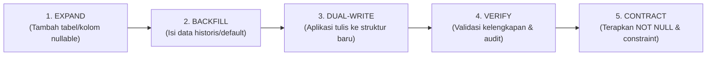

# RENCANA RESTRUKTURISASI PLATFORM AVA GLOBAL ECOSYSTEM (TAHAP 2)
### Blueprinted Transition Architecture & Database Migration Plan
**Dokumen Rujukan:** `AVA-DOC-ARCH-2026-V5.1` & `PROMPT-ANTIGRAVITY-Restrukturisasi-AVA-Global`  
**Status:** Tahap 2 — Selesai (Rencana Tanpa Kode Produksi)  
**Tanggal:** 30 Agustus 2026  
**Auditor:** Principal Engineer / Antigravity Agent  

---

## A. TARGET ARSITEKTUR KONKRET

### 1. Struktur Direktori Sasaran (Clean Modular Architecture)

Sistem akan dirapikan menjadi struktur modular yang memisahkan **Shared Kernel** dari **Enam Unit Bisnis (Brand)** tanpa merusak file yang sudah berjalan:

```
AVA GLOBAL ECOSYSTEM
├── core/                           # SHARED KERNEL (Milik AVA Tech & HQ)
│   ├── mpi/                        # Master Person Index (AVA-ID, Matcher, Merger)
│   ├── iam/                        # RBAC 18 Peran, Auth JWT, Password Argon2id
│   ├── audit/                      # Append-only Audit Trail + Hash Chaining
│   ├── events/                     # Outbox Publisher & Event Subscriber
│   ├── numbering/                  # Central Document Numbering Service (Row-Lock)
│   ├── security/                   # Enkripsi Kolom K4 & PII Guard
│   └── router/                     # 3-Segment Namespace Router (Strangler Fig)
│
├── modules/
│   ├── hq/                         # L0: AVA GLOBAL GROUP (HOLDING)
│   │   ├── cockpit/                # Dashboard, Ops Control, CEO Cockpit
│   │   ├── finance/                # Konsolidasi Finansial, Transfer Internal
│   │   └── legal/                  # Brand Registry, KBLI 2025, Activity Matrix
│   │
│   ├── lab/                        # AVA LAB (LIS & ISO 15189:2022)
│   │   ├── pre/                    # Order, Check-in, Acceptance, Routing
│   │   ├── ana/                    # Worklist, Interfacing, Result Entry
│   │   ├── qc/                     # Daily QC, Levey-Jennings, Westgard
│   │   ├── post/                   # Validation Sp.PK, Critical Log, PDF Release
│   │   ├── master/                 # Test Catalog (LOINC/UCUM), Panels, Specs
│   │   └── qms/                    # ISO 15189 Document Control & CAPA
│   │
│   ├── health/                     # AVA HEALTH (HIS, CLINIC, EMR, CORP MCU)
│   │   ├── his/                    # Admission, EMR SOAP, Orders, Pharmacy
│   │   ├── queue/                  # Loket, TV Display, Audio TTS
│   │   ├── kiosk/                  # Kiosk Touchscreen Tiket & Self-Reg
│   │   ├── apps/                   # Patient App, Doctor App, Corp Portal
│   │   └── corp/                   # MCU Projects, Roster, Mass Results, Fitwork
│   │
│   ├── care/                       # AVA CARE (HOME CARE & CAREGIVING)
│   │   ├── order/                  # Intake, Triase, Estimasi Tarif
│   │   ├── dispatch/               # Penugasan Nakes, Rute & GPS
│   │   └── service/                # Form Tindakan Digital & Home Sampling
│   │
│   ├── nutri/                      # AVA NUTRITION (PABRIK & D2C FMCG)
│   │   ├── rnd/                    # Formulasi, Klaim, Uji Lab
│   │   ├── reg/                    # BPOM, Halal, CPOTB
│   │   ├── prod/                   # Batch Record & Recall
│   │   └── sales/                  # Multi-Channel OMS, Langganan, Ekspedisi
│   │
│   ├── sanct/                      # AVA SANCTUARY (WELLNESS & MEDSPA)
│   │   ├── client/                 # Profil Wellness & Clearance Dokter
│   │   ├── booking/                # Kalender 3D (Terapis × Ruangan × Sesi)
│   │   ├── ops/                    # Suites Status, Housekeeping, Consumables
│   │   └── program/                # Postnatal Care & Membership
│   │
│   └── tech/                       # AVA TECH (PLATFORM, INTEGRASI, AI, ENGINES)
│       ├── platform/               # Tenancy, IAM, Security, Monitoring
│       ├── integration/            # SATUSEHAT FHIR, BPJS, Analyzer LIS
│       ├── ai/                     # QMS Delimiter Engine, AI Rewriter, Canvas
│       └── core_engines/           # GL Engine, Payroll Engine, PACS Server
```

### 2. Batas Shared Kernel vs Ekstensi Unit (ADR-02)
- **Tunggal di Shared Kernel:** `mpi_person`, `iam_user`, `sys_audit_log`, `sys_event_outbox`, `sys_number_registry`, `fin_account`.
- **Ekstensi per Unit:**
  - HRD: `hr_employee` (Kernel) + `employee_profile_clinical` (Lab/Health/Care) + `employee_profile_production` (Nutrition) + `employee_profile_corporate` (HQ/Tech).
  - Inventory: `inv_item` (Kernel) + `inv_lot_clinical` (Reagen suhu dingin Lab) + `inv_lot_batch` (Batch produksi Nutrition CPOTB).
  - Billing/POS: `billing_invoice` (Kernel) + split bill penjaminan (Health/Lab) + deferred revenue membership (Sanctuary) + OMS invoice (Nutrition).

---

## B. STRATEGI UNTUK STACK CAMPURAN (STRANGLER FIG PATTERN)

Untuk memastikan **transisi mulus tanpa downtime dan tanpa regresi**:

1. **Routing Strangler Fig di Frontend:**
   - `router.js` ditingkatkan ke versi dual-compatible:
     - Jika rute berupa 3 segmen (misal `lab/ana/worklist`), router langsung mengeksekusi modul terstruktur baru.
     - Jika rute berupa nama legacy (misal `admission`, `lab`, `mcu`, `cashier`, `marketing`), router memetakan alias ke modul yang sesuai secara otomatis.
   - Tidak ada link bookmark, portal, atau script lama yang patah.

2. **Koeksistensi Web SPA & Electron PGlite:**
   - Web Platform (`ava-platform/`) dan Desktop App (`desktop-app/`) menggunakan skema database SQL yang identik.
   - PGlite lokal menjalankan migrasi yang sama persis dengan PostgreSQL Supabase Cloud.
   - Sinkronisasi offline-to-cloud dieksekusi melalui `sys_event_outbox` (`db/migrations/0006_sync_outbox.sql` & `0026_fase0_event_outbox_dimensi.sql`).

3. **Isolasi Klinis K4 (ADR-07):**
   - Ditegakkan di dua lapisan:
     - **Lapisan Data:** PostgreSQL Row Level Security (RLS) membatasi akses tabel rekam medis hanya untuk peran berizin klinis.
     - **Lapisan Event:** Payload event outbox `lab.result.released` hanya memuat metadata (`ava_id`, `service_code`, `status`), tidak memuat hasil lab numerik atau catatan medis.

---

## C. RENCANA MIGRASI DATABASE (EXPAND → BACKFILL → DUAL-WRITE → VERIFY → CONTRACT)

Setiap perubahan skema dijalankan dengan metode non-destruktif:



### Rincian File Migrasi Fase 0 (db/migrations/)

| File Migrasi | Objek yang Dibuat / Diubah | Status Tabel | Skrip Rollback (Down) |
|---|---|---|---|
| `0021_fase0_konvensi_identitas.sql` | Fungsi `uuid_generate_v7()`, fungsi `generate_ava_id()` Base32 Crockford, tabel `sys_number_registry`. | Baru | `DROP FUNCTION IF EXISTS`, `DROP TABLE IF EXISTS sys_number_registry`. |
| `0022_fase0_tenancy_organisasi.sql` | Tabel `tenant`, `brand`, `cost_center`, `location`, `kbli_registry`, `permit`, `permit_pic`, `service_activity_map`. Seed 6 brand + HQ + KBLI. | Baru | `DROP TABLE IF EXISTS service_activity_map, permit_pic, permit, kbli_registry, location, cost_center, brand, tenant CASCADE`. |
| `0023_fase0_mpi_master_person.sql` | Tabel `mpi_person`, `person_identifier`, `person_contact`, `person_consent`, `person_brand_link`, `person_merge_log`. Backfill pasien lama ke `mpi_person`. | Baru + Backfill `patients` | `DROP TABLE IF EXISTS person_merge_log, person_brand_link, person_consent, person_contact, person_identifier, mpi_person CASCADE`. |
| `0024_fase0_iam_rbac_audit.sql` | 18 Peran Baku V5.1, tabel `iam_user`, `user_role`, `role_permission`, `sys_audit_log` (append-only hash chain). | Baru | `DROP TABLE IF EXISTS sys_audit_log, user_role, role_permission, iam_user, role CASCADE`. |
| `0025_fase0_kolom_wajib_transaksi.sql` | **EXPAND:** Tambah 9 kolom wajib ke `products`, `orders`, `samples`, `examinations`, `invoices`, `mcu_projects`. **BACKFILL:** Isi `tenant_id = 'lokal'`, `brand_code = 'LAB'/'HEALTH'`. | Tabel Live (~530 products, ratusan sample/order dev) | `ALTER TABLE ... DROP COLUMN IF EXISTS ...` untuk 9 kolom wajib. |
| `0026_fase0_event_outbox_dimensi.sql` | Tabel `sys_event_outbox`, `fin_account`, `fin_dimension`, `fin_posting_rule`, `fin_internal_transfer_rate`. | Baru | `DROP TABLE IF EXISTS fin_internal_transfer_rate, fin_posting_rule, fin_dimension, fin_account, sys_event_outbox CASCADE`. |
| `0027_fase0_rls_policies.sql` | Row Level Security (RLS) policies pada seluruh tabel untuk isolasi `tenant_id` dan penegakan ADR-07. | Alter Table | `ALTER TABLE ... DISABLE ROW LEVEL SECURITY; DROP POLICY ...`. |

### Rencana Verifikasi Backfill & Integritas Data
1. **Verifikasi 9 Kolom Wajib:**
   ```sql
   SELECT table_name, column_name 
   FROM information_schema.columns 
   WHERE table_schema = 'public' 
     AND table_name IN ('products', 'orders', 'samples', 'invoices')
     AND column_name IN ('tenant_id', 'brand_code', 'cost_center_code', 'kbli_code', 'created_at', 'is_deleted');
   ```
2. **Verifikasi Keutuhan Master Katalog (Hard Rule §4.3 AGENTS.md):**
   - Query memastikan 0 baris `Kode Material` atau `Nama Pemeriksaan` yang berubah:
   ```sql
   SELECT count(*) FROM public.products WHERE kode_material IS NULL OR nama_tes IS NULL; -- Wajib 0
   ```
3. **Verifikasi Imutabilitas Audit:**
   - Percobaan `DELETE FROM public.sys_audit_log` wajib memicu database trigger exception `CANNOT_DELETE_AUDIT_LOG`.

---

## D. URUTAN IMPLEMENTASI FONDASI (FASE 0 BLUEPRINT)

Sesuai aturan Bab 22.5 Blueprint, implementasi fondasi dilakukan berurutan:

1. **Langkah 1: Konvensi Identitas & Penomoran (Bab 15)**
   - Generator UUID v7 & Base32 AVA-ID.
   - Layanan penomoran dokumen resmi terpusat dengan row-locking (`tech/core/numbering`).
2. **Langkah 2: Registri Tenancy & Legalitas Organisasi (Bab 16.3)**
   - Master Brand (HEALTH, LAB, CARE, NUTRI, TECH, SANCT, HQ), Cost Center, KBLI Registry 2025, Permit & Activity Matrix.
3. **Langkah 3: Master Person Index (MPI) Tunggal (Bab 16.4)**
   - Engine registrasi orang, deteksi duplikat multi-kriteria, log merge/unmerge, manajemen consent K4 terpisah.
4. **Langkah 4: IAM, RBAC 18 Peran Baku & Audit Trail Imutabel (Bab 16.5, 19)**
   - Matriks peran baku (SUPERADMIN s/d AUDITOR_READONLY), audit log hash chain SHA-256.
5. **Langkah 5: Penanaman 9 Kolom Wajib & Migrasi Skema Expand (Bab 16.2)**
   - Penambahan kolom dimensi segmen pada seluruh tabel transaksi tanpa merusak data master 530+ tes katalog.
6. **Langkah 6: Event Outbox & Dimensi Keuangan (Bab 16.7, 16.8, 17)**
   - Tabel `sys_event_outbox` dengan amplop standar ADR-07 dan struktur Chart of Account berdimensi 4 kolom.
7. **Langkah 7: Isolasi Data Row Level Security (RLS) (ADR-07, ADR-08, Bab 20)**
   - Pemaksaan isolasi tenant di level database engine.
8. **Langkah 8: Router Namespace 3 Segmen Strangler Fig (Bab 15.1)**
   - Penyesuaian `router.js` dan `modul-manifest.js` untuk mendukung routing 3 segmen.

---

## E. DAFTAR KEPUTUSAN YANG MEMBUTUHKAN PERSETUJUAN (GATE 2)

1. **Struktur Peran Akun Utama:**
   - Akun pengguna utama (`aceanwar424`) akan diberikan peran gabungan:
     - `SUPERADMIN` (Konfigurasi platform)
     - `HQ_EXECUTIVE` (Akses holding cockpit & P&L agregat)
     - `DOCTOR_SPPK` (Otoritas validasi medis & tanda tangan rilis hasil LIS)
2. **Format Dokumen Resmi:**
   - Format standar yang akan dikunci: `AVA/{BRAND}/{JENIS}/{BULAN_ROMAWI}/{YYYY}/{NOMOR_URUT_5_DIGIT}`.
3. **Penetapan Nilai Default Dimensi pada Data Eksisting:**
   - Transaksi lab yang sudah ada akan di-backfill dengan:
     - `tenant_id` = `'00000000-0000-0000-0000-000000000001'` (`lokal`)
     - `brand_code` = `'LAB'`
     - `cost_center_code` = `'CC-LAB-01'`
     - `kbli_code` = `'86105'` (Klinik/Lab Rujukan)
     - `location_code` = `'LOC-PST-01'`

---
🛑 **GATE 2 REACHED: Rencana Restrukturisasi & Rencana Migrasi Database Selesai Disusun.**  
**Menunggu persetujuan tertulis sebelum mulai mengeksekusi penulisan kode Tahap 3 (Implementasi Fondasi Fase 0).**
